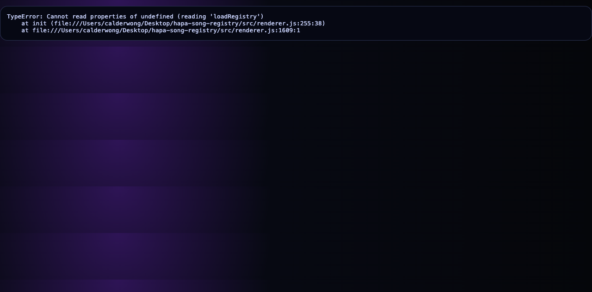

# Hapa Song Registry

Hapa Song Registry is a local Electron desktop app for browsing, validating, and playing the downloaded Suno/Hapa music library. In the Hapa node ecosystem it acts as the music/stem registry node: it turns local Suno exports and Hapa lyric documents into searchable song, stem, lyric, prompt, timing, and DAW-workstation surfaces for later canon, media, and attribution workflows.

Global wiki link: `../Hapa_Worldbuilding_Wiki/Nodes/Existing/hapa-song-registry.md` (`[[Nodes/Existing/hapa-song-registry]]`).

## Verified current state

Verified from repository files and `data/registry.json` during the 2026-05-21 docs/licensing sweep:

- App shell: Electron + vanilla HTML/CSS/JS (`src/main.js`, `src/preload.js`, `src/index.html`, `src/renderer.js`).
- DAW/stem engine: Web Audio shared-clock multitrack engine in `src/daw-engine.js`.
- Ingestion pipeline: Python scripts under `scripts/` build and verify registry data.
- Test suite: Python `unittest` tests under `test/`.
- Current registry counts in `data/registry.json`:
  - 1,461 songs
  - 4,476 stems
  - 638 lyric/similarity groups
  - 5,000 similarity links
  - 3 external lyric documents
  - 206 lyric masters
  - 651 prompt groups
  - 98 mashups
  - 1,192 songs with lyric timings

## Inputs

- Suno telemetry export: `$HAPA_SUNO_LIBRARY_ROOT/suno_library_metadata.json`.
- Local audio files discovered below `$HAPA_SUNO_LIBRARY_ROOT`.
- External lyric roots used by default:
  - `$HAPA_SONG_LYRICS_ROOT`
  - `$HAPA_SONG_LIBRARY_ROOT`
- Existing timing cache: `data/lyric_timings/*.json`.

## Outputs and local state

Generated/updated outputs are local runtime artifacts, not network services:

- JSON app cache: `data/registry.json`.
- SQLite registry: `data/hapa_registry.sqlite`.
- Per-song lyric timing files: `data/lyric_timings/*.json`.
- Runtime event/history log: `data/history_events.json`.
- Optional loop/mix derivatives: `data/derivatives/`.

The app does not define an HTTP port. It runs as an Electron desktop window via `npm start`. No repository-local authentication layer was found; access is the local user/session boundary plus local filesystem permissions.

## Run

```bash
cd "$HAPA_SONG_REGISTRY_ROOT"
npm install
python3 -m pip install -r requirements.txt
npm start
```

## Rebuild telemetry registry

```bash
cd "$HAPA_SONG_REGISTRY_ROOT"
npm run ingest
npm run check
```

`npm run ingest` reads the Suno export and local lyric roots, writes `data/registry.json`, and updates `data/hapa_registry.sqlite`.

## Analyze lyric timings

```bash
cd "$HAPA_SONG_REGISTRY_ROOT"
npm run analyze-lyrics
npm run check
```

This decodes local audio with ffmpeg, detects vocal/phrase activity, maps Suno lyric lines onto the analyzed phrase timeline, and writes per-line timestamps into `data/registry.json`, `data/lyric_timings/*.json`, and SQLite.

## Verification commands

Cheap checks available in this repo:

```bash
npm test
npm run check
```

`npm test` runs the Python unit tests. `npm run check` syntax-checks the Electron JavaScript entrypoints and verifies the generated registry JSON/SQLite counts.

## App features

- Search across title, prompt, lyrics, tags, and model.
- Filter by theme, instrument, mood, message, model, audio/stem presence, prompt group, mashup/non-mashup, and variation range.
- Sort by newest, oldest, title, duration, stem count, variation count, and model.
- Play local song audio and queue filtered songs as a playlist.
- View normalized telemetry and raw Suno metadata.
- View prompt, lyrics with audio-analyzed timestamps, style tags, settings, model, duration, local paths, and URLs.
- See groups, prompt groups, mashups, and similarity/variation links.
- See purchased/generated stems by type.
- Toggle stem tracks, mute/solo stems, control stem volume/pan, and use a Web Audio DAW engine for synchronized stem sessions.
- Capture loop regions and render mixer derivatives through ffmpeg.
- Show the current audio file in Finder.

## Hapa role: verified vs inferred

Verified: the repository is a local Electron/Python registry for the Suno/Hapa music library with song, stem, lyric, timing, mashup, and DAW-workstation affordances.

Inferred: inside Hapa, this node can feed music canon review, Roll-The-Tapes/media generation workflows, lyric/prompt lineage, stem reuse, and future Bananas attribution trails. Those integrations are not presented here as active network services unless another node imports this repo's JSON/SQLite outputs.

## Licensing and attribution

Project-level license: MIT under Hapa.ai / Calder Wong. See `LICENSE`.

Third-party dependencies keep their own licenses in `package-lock.json` and `node_modules` metadata; those notices are not replaced by the project-level MIT license.

Bananas attribution option: contributors may opt into Bananas work-contribution tracking for attribution. Bananas tracking is attribution/accounting metadata, not an additional copyright restriction on the MIT-licensed project.

## Notes and risks

- Registry data may contain local filesystem paths and generated music metadata. Treat `data/` outputs as local operational state unless intentionally publishing a sanitized snapshot.
- Lyric timing is generated offline from local audio. The analyzer uses purchased/generated Vocals stems when available and falls back to the full mix otherwise. These are phrase-level, audio-derived timings rather than word-level forced alignment; songs with dense mixes or ad-libbed/generated vocals may still be approximate.
- Stem playback and DAW engine behavior depend on browser/Electron Web Audio support and readable local audio paths.

<!-- HAPA-README-SCREENSHOT-2026-05-22 -->

## Screenshot



Hapa Song Registry static-file fallback; Electron preload is required for the full registry UI.


<!-- HAPA-README-QUALITY-PASS-2026-05-22 -->

## Hapa ecosystem context

<p>
  
</p>

### Shared ecosystem pattern

Hapa is built as a constellation of modular nodes. Each node owns a focused capability, but participates in a shared protocol for provenance, handoff, cards, memory, and operations.

Every node is designed for both human operators and AI agents. The target contract is three surfaces: a UI for direct human review/control, an API for node-to-node and agent calls, and a CLI for scripted runs, audits, and handoffs. Individual repos may be at different maturity levels, but the public contract is that humans and agents can inspect, operate, and verify the node.

Hapa nodes power AI agents and avatar-agents that build new nodes and enhance existing ones. As work moves through the ecosystem, it is mined for utility, wisdom, and repeatable logic, then distilled into Hapa Cards: portable packets of skills, context, memories, and operational patterns.

Humans and AIs use Hapa Cards to discuss, ideate, prototype, and deploy increasingly complex workflows through a playable, card-collecting mechanic. Collaboration history, skills, work artifacts, and canonical decisions are stored in [hapa-second-brain](https://github.com/calderwong/hapa-second-brain), enriched into [Hapa Worldbuilding Wiki](https://github.com/calderwong/hapa-worldbuilding-wiki) entries, and converted back into cards. Avatar-agents can also be combined or specialized into purpose-built identities with their own storage, lore, canon, card decks, skills, and protocols.

### Purpose

Local registry for Hapa songs, Suno/imported audio assets, lyrics, prompts, timing analysis, and music-library metadata.

### Current status

- Status: **active music registry**.
- Local source root: `$HAPA_SONG_REGISTRY_ROOT`.
- This README is intended to be useful to both human operators and future agents: it should explain what the node is for, what it consumes, what it emits, how it connects to other Hapa nodes, and what should stay out of git.

### Inputs

- Suno library audio, lyric docs, prompt archives, timing-analysis scripts, manual metadata edits

### Outputs

- Registry JSON/SQLite records, song metadata, lyric timing artifacts, and searchable library views

### Interfaces

- Electron renderer
- Data/SQLite registry
- Scripts for lyric/audio analysis

### Related Hapa nodes

- [hapa-dev-proto](https://github.com/calderwong/hapa-dev-proto-private) — Primary local-first app; many nodes feed it cards, assets, chat, debug, or projection data.
- [Hapa_Worldbuilding_Wiki](https://github.com/calderwong/hapa-worldbuilding-wiki) — Canonical Markdown graph for lore, nodes, names, cards, systems, and provenance.
- [.Overwatch](https://github.com/calderwong/overwatch) — Operations map: inventory, source index, task inbox, protocols, and runbooks.
- [hapa-telemetry-node](https://github.com/calderwong/hapa-telemetry-node) — Discovery/monitoring hub for node health, capabilities, launchers, and relationships.
- [hapa-keys-node](https://github.com/calderwong/hapa-keys-node) — Local key vault used by authenticated nodes and tools.
- [hapa-lore-node](https://github.com/calderwong/hapa-lore-node) — Chronicle/canon service for daily progress, lore, and searchable wisdom.
- [hapa-anvil-node](https://github.com/calderwong/hapa-anvil-node) — Card standardization/evaluation/forge node for turning raw card ideas into usable artifacts.
- [hapa-janus-world-node](https://github.com/calderwong/hapa-janus-world-node) — World-state truth kernel and event tape for Janus/desktop simulation work.
- [hapa-mlx-station](https://github.com/calderwong/hapa-mlx-station) — Apple Silicon media-generation station that produces visual/audio assets for cards, wiki, and production runs.
- [hapa-lance-node](https://github.com/calderwong/hapa-lance-node) — Local indexing/projection layer for cards, wiki chunks, embeddings, and multimodal records.

### Operating contract

- Treat generated media, local databases, model weights, dependency folders, build outputs, app bundles, and secrets as runtime artifacts unless this README explicitly says otherwise.
- Prefer loopback/local operation first; expose network services only with explicit auth and operator intent.
- When this node produces artifacts for another node, record enough provenance for the receiving node or wiki page to recover the source path, command, prompt, or API request.
- Keep `README.md`, `LICENSE`, `NOTICE.md` where applicable, and repo-local screenshots current as the node evolves.
